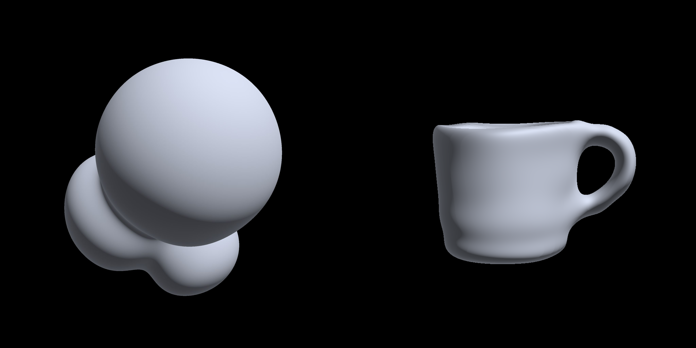

# Neural SDF
## Generate neural SDF from mesh

This is an implementation of a [Implicit Neural Representations with Periodic Activation Functions ](https://arxiv.org/abs/2006.09661) in C++ and Vulkan. The SIREN (Sinusoidal Representation Networks) model enables the representation of complex signals and shapes using periodic activation functions.

  

## Prerequisites

- C++ Compiler (C++17 or higher)
- Vulkan SDK

## Building

```bash
make
```

## Usage

To train a neural SDF, run the following command:
```bash
./neural_sdf --train -i <input.obj> -n <layers> -s <layer_size> -o <out_weights>
```
> **Note:** The input mesh must be watertight and triangulated before training.

The weights are saved in a float array in sequence by layers ($A_1$, $b_1$, $A_2$, $b_2$, ...,
$A_k$, $b_k$), with matrices stored row-wise. The binary file does not contain the size of the
array, since it is uniquely determined by the network architecture. The input is a `float[3]` 3D point and the output is a scalar `float` distance to surface. Activation function for all layers is  sin($w_0 \cdot W x$ + $b$), except the last layer, which has no activation. $w_0$ is a constant equal to 30.

To render using the trained weights, run:
```bash
./neural_sdf --render -m <path_to_weights> -n <layers> -s <layer_size>
```

Example usage:
```bash
./neural-sdf --render -m data/sdf1_weights.bin -n 2 -s 64
```

Rendered image will be saved in the `output` directory.

## License

This project is licensed under the MIT License - see the [LICENSE](LICENSE) file for details.

## References

SIREN: Implicit Neural Representations with Periodic Activation Functions - [Link](https://arxiv.org/abs/2006.09661)
